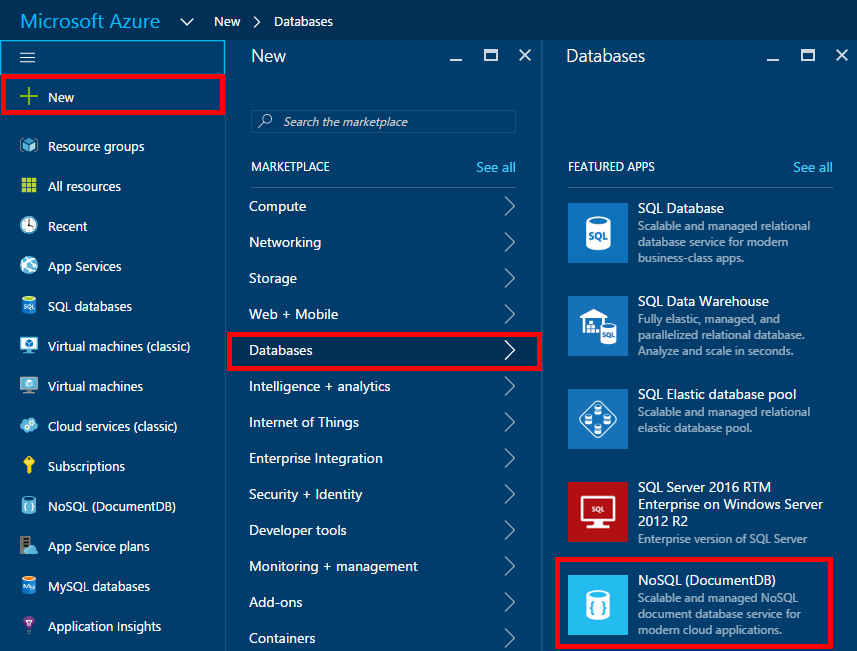
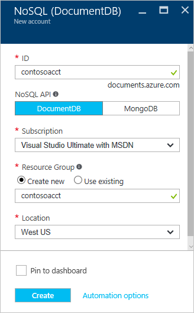

# Lab Manual #

## Setting up your Azure account ##

You may activate an Azure free trial at https://azure.microsoft.com/en-us/free/.  

If you have been given an Azure Pass to complete this lab, you may go to http://www.microsoftazurepass.com/ to activate it.  Please follow the instructions at https://www.microsoftazurepass.com/howto, which document the activation process.  A Microsoft account may have one free trial on Azure and one Azure Pass associated with it, so if you have already activated an Azure Pass on your Microsoft account, you will need to use the free trial or use another Microsoft account.

## Navigating the Solution ##

There are two main top-level directories:

- **Starting**: This contains _skeleton_ code with parts missing that serves as the baseline for the tutorial. You should _start_ here.
- **Finished**: We have included the _finished_ solution, so that you can examine our take on what the code should look like. If you fall behind during the tutorial session, feel free to take code from here and use it in your solution.

In both, we have created a Solution (.sln) which contains several different projects, let's take a high-level look at them:

- **ImageProcessingLibrary**: This is a Portable Class Library (PCL) containing helper classes for accessing the various Cognitive Services related to Vision, and some "Insights" classes for encapsulating the results.
- **ImageStorageLibrary**: Since DocumentDB does not (yet) support UWP, this is a non-portable library for accessing Blob Storage and DocumentDB.
- **TestApp**: A UWP application that allows you to load your images and call the various cognitive services on them, then explore the results. Useful for experimentation and exploration of your images.
- **TestCLI**: A Console application allowing you to call the various cognitive services and then upload the images and data to Azure. Images are uploaded to Blob Storage, and the various metadata (tags, captions, faces) are uploaded to DocumentDB.

Both _TestApp_ and _TestCLI_ contain a `settings.json` file containing the various keys and endpoints needed for accessing the Cognitive Services and Azure. They start blank, so once you get your Azure Pass up and running we can provision your service keys and set up your storage account and DocumentDB instance.

## Navigating the Azure portal ##

After creating an Azure account, you may access the Azure portal at https://portal.azure.com.  

## Getting Cognitive Services API Keys ##

Within the Portal, we'll first create keys for the Cognitive Services we'll be using. We'll primarily be using different APIs under the [Computer Vision](https://www.microsoft.com/cognitive-services/en-us/computer-vision-api) Cognitive Service, so let's create an API key for that first.

In the Portal, hit **New** and then enter **cognitive** in the search box and choose **Cognitive Services**:

This will lead you to fill out a few details for the API endpoint you'll be creating, choosing the API you're interested in and where you'd like your endpoint to reside, as well as what pricing plan you'd like. We'll be using S1 so that we have the throughput we need for the tutorial, and creating a new _Resource Group_. We'll be using this same resource group below for our Blob Storage and DocumentDB, so pick something you like. _Pin to dashboard_ so that you can easily find it. Since the Computer Vision API stores images internally at Microsoft (in a secure fashion) to help improve future Cognitive Services Vision offerings, you'll need to _Enable_ Account creation. This can be a stumbling block for users in Enterprise environment, as only Subscription Administrators have the right to enable this, but for Azure Pass users it's not an issue.

 

Once you have created your new API subscription, you can grab the keys from the appropriate section of the blade, and add them to your _TestApp's_ and _TestCLI's_ `settings.json` file.

We'll also be using other APIs within the Computer Vision family, so take this opportunity to create API keys for the _Emotion_ and _Face_ APIs as well. They are created in the same fashion as above, and should re-use the same Resource Group you've created. _Pin to Dashboard_, and then add those keys to your `settings.json` files.

Since we'll be using [LUIS](https://www.microsoft.com/cognitive-services/en-us/language-understanding-intelligent-service-luis) later in the tutorial, let's take this opportunity to create our LUIS subscription here as well. It's created in the exact same fashion as above, but choose Language Understanding Intelligent Service from the API drop-down, and re-use the same Resource Group you created above. Once again, _Pin to Dashboard_ so once we get to that stage of the tutorial you'll find it easy to get access.  

## Setting up Storage ##

We'll be using two different stores in Azure for this project - one for storing the raw images, and the other for storing the results of our Cognitive Service calls. Azure Blob Storage is made for storing large amounts of data in a format that looks similar to a file-system, and is a great choice for storing data like images. Azure DocumentDB is our resilient NoSQL PaaS solution, and is incredibly useful for storing loosely structured data like we have with our image metadata results. There are other possible choices (Azure Table Storage, SQL Server), but DocumentDB gives us the flexibility to evolve our schema freely (like adding data for new services), query it easily, and can be quickly integrated into Azure Search.

### Azure Blob Storage ###

Detailed "Getting Started" instructions can be [found online](https://docs.microsoft.com/en-us/azure/storage/storage-dotnet-how-to-use-blobs), but let's just go over what you need for this lab.

Within the Azure Portal, click **New->Storage->Storage Account**

Once you click it, you'll be presented with the fields above to fill out. Choose your storage account name (lowercase letters and numbers), set _Account kind_ to _Blob storage_, _Replication_ to _Locally-Redundant storage (LRS)_ (this is just to save money), use the same Resource Group as above, and set _Location_ to _West US_.  (The list of Azure services that are available in each region is at https://azure.microsoft.com/en-us/regions/services/.) _Pin to dashboard_ so that you can easily find it.

Now that you have an Azure Storage account, let's grab the _Connection String_ and add it to your _TestCLI_ `settings.json`.

### DocumentDB ###

Detailed "Getting Started" instructions can be [found online](https://docs.microsoft.com/en-us/azure/documentdb/documentdb-get-started), but we'll walk through what you need for this project here.

Within the Azure Portal, click **New->Databases->NoSQL (DocumentDB)**.

Once you click this, you'll have to fill out a few fields as you see fit. 

In our case, select the ID you'd like, subject to the constraints that it needs to be lowercase letters, numbers, or dashes. We will be using the DocumentDB SDK and not Mongo, so select DocumentDB as the NoSQL API. Let's use the same Resource Group as we used for our previous steps, and the same location, select _Pin to dashboard_ to make sure we keep track of it and it's easy to get back to, and hit Create.

Once creation is complete, open the panel for your new database and select the _Keys_ sub-panel.

You'll need the **URI** and the **PRIMARY KEY** for your _TestCLI's_ `settings.json` file, so copy those into there and you're now ready to store images and data into the cloud.

## Exploring Cognitive Services and Image Processing Library ##

When you open the `ImageProcessing.sln` solution, from either the `Starting` or `Finished` directory, you will find a UWP application (`TestApp`) that allows you to load your images and call the various cognitive services on them, then explore the results. It is useful for experimentation and exploration of your images. This app is built on top of the `ImageProcessingLibrary` project.

## Exploring DocumentDB ##

### Implementing DocumentDBHelper ###

With `ImageProcessing.sln` from the `Starting` directory open, look in the `ImageStorageLibrary` project for the `DocumentDBHelper.cs` class. Take a look for `NotImplementedException` and you'll notice quite a few in the file. These are _suggested_ operations - feel free to implement different ones instead if they suit your needs. Many of the implementations can be found in the [Getting Started guide](https://docs.microsoft.com/en-us/azure/documentdb/documentdb-get-started).

Once you've implemented the operations in the helper, got to `TestCLI`'s `Util.cs` and notice that the `ImageMetadata` class has some gaps. We need to turn the `ImageInsights` we retrieve from Cognitive Services into appropriate Metadata to be stored into DocumentDB.

Finally, look in `Program.cs` and notice in `ProcessDirectoryAsync` there's a `NotImplementedException` after we store the image into Blob Storage, but before we store its metadata. We should fix that as well.

### Loading Images Using TestCLI ###

Once you've set your Cognitive Services API keys, your Azure Blob Storage Connection String, and your DocumentDB Endpoint URI and Key in your _TestCLI's_ `settings.json`, and fixed all of the missing pieces above, you're ready to go. Build _TestCLI_, and run it:

    > .\bin\Debug\TestCLI.exe

    Usage:  [options]

    Options:
    -force            Use to force update even if file has already been added.
    -settings         The settings file (optional, will use embedded resource settings.json if not set)
    -process          The directory to process
    -query            The query to run
    -? | -h | --help  Show help information

By default, it will load your settings from `settings.json` (it builds it into the `.exe`), but you can provide your own using the `-settings` flag. To load images (and their metadata from Cognitive Services) into your cloud storage, you can just tell _TestCLI_ to `-process` your image directory as follows:

    > .\bin\Debug\TestCLI.exe -process c:\my\image\directory

Once it's done processing, you can query against your DocumentDB directly using _TestCLI_ as follows:

    > .\bin\Debug\TestCLI.exe -query "select * from images"

## Building an Azure Search Index ## 

### Create an Azure Search Service ### 

Within the Azure Portal, click **New->Web + Mobile->Azure Search**.

Once you click this, you'll have to fill out a few fields as you see fit. For this lab, a "Free" tier is sufficient.

Once creation is complete, open the panel for your new search service.

### Create an Azure Search Index ### 

An Index is the container for your data and is a similar concept to that of a SQL Server table.  Like a table has rows, an Index has documents.  Like a table that has fields, an Index has fields.  These fields can have properties that tell things such as if it is full text searchable, or if it is filterable.  You can populate content into Azure Search by programatically [pushing content](https://docs.microsoft.com/en-us/rest/api/searchservice/addupdate-or-delete-documents) or by using the [Azure Search Indexer](https://docs.microsoft.com/en-us/azure/search/search-indexer-overview) (which can crawl common datastores for data).

For this lab, we will use the [Azure Search Indexer for DocumentDB](https://docs.microsoft.com/en-us/azure/search/search-howto-index-documentdb) to crawl the data in the the DocumentDB container. 

 

Within the Azure Search blade you just created, click **Import Data->Data Source->DocumentDB**.

 

Once you click this, choose a name for the DocumentDB datasource and choose the DocumentDB account where your data resides as well as the cooresponding Container and Collections.  

Click **OK**.

At this point Azure Search will connect to your DocumentDB container and analyze a few documents to identify a default schema for your Azure Search Index.  After this is complete, you can set the properties for the fields as needed by your application.

Update the Index name to: **images**

Update the Key to: **rid** (which uniquely identifies each document)

Set all fields to be **Retrievable** (to allow the client to retrieve these fields when searched)

Set the fields **Tags, NumFaces, and Faces** to be **Filterable** (to allow the client to filter results based on these values)

Set the field **NumFaces** to be **Sortable** (to allow the client to sort the results based on the number of faces in the image)

Set the fields **Tags, NumFaces, and Faces** to be **Facetable** (to allow the client to group the results by count, for example for your search result, there were "5 pictures that had a Tag of "beach")

Set the fields **Caption, Tags,and Faces** to be **Searchable** (to allow the client to do full text search over the text in these fields)

 

At this point we will configure the Azure Search Analyzers.  At a high level, you can think of an analyzer as the thing that takes the terms a user enters and works to find the best matching terms in the Index.  Azure Search includes analyzers that are used in technologies like Bing and Office that have deep understanding of 56 languages.  

Click the **Analyzer** tab and set the fields **Caption, Tags,and Faces** to use the **English-Mocrosoft** analyzer

 

For the final Index configuration step we will set the fields that will be used for type ahead, allowing the user to type parts of a word where Azure Search will look for best matches in these fields

Click the **Suggeester** tab and enter a Suggester Name: **sg** and choose **Tags and Faces** to be the fields to look for term suggestions

 

Click **OK** to complete the configuration of the Indexer.  You could set at schedule for how often the Indexer should check for changes, however, for this lab we will just run it once.  

Click **Advanced Options** and choose to **Base 64 Encode Keys** to ensure that the RID field only uses characters supported in the Azure Search key field.

Click **OK, three times** to start the Indexer job that will start the importing of the data from the DocumentDB database.

 

***Query the Search Index***

You should see a message pop up indicating that Indexing has started.  If you wish to check the status of the Indexer, you can choose the "Indexer" option in the main Azure Search blade.

At this point we can try searching the index.  

Click **Search Explorer** and in the resulting blade choose your Index if it is not already selected.

Click **Search** to search for all documents.

 

