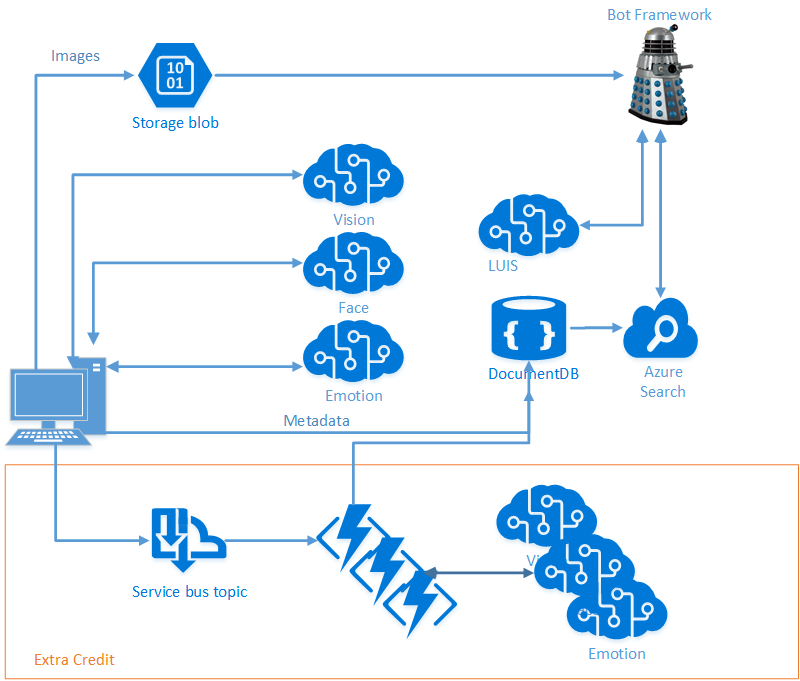

# Cognitive Services Tutorial

Cognitive Services Tutorial for [AI Immersion Workshop 2017](https://blogs.technet.microsoft.com/machinelearning/2017/03/13/microsoft-ai-immersion-workshop-in-seattle-may-9th-2017/)

# Goals

The goal of the Cognitive Services track for the AI Immersion Workshop is to give Build attendees the opportunity to build an end-to-end scenario using Cognitive Services and other Microsoft Azure technologies in tandem, proving that the whole is greater than the sum of its parts and providing a code-base to build on well after the session is over.

# Scenario

We're building an end-to-end scenario that allows you to pull in your own pictures, use Cognitive Services to find objects and people in the images, figure out how those people are feeling, and store all of that data into a NoSQL Store (DocumentDB). We use that NoSQL Store to populate an Azure Search index, and then build a Bot Framework bot using LUIS to allow easy, targeted querying.

We walk through the scenario in detail in the **[Lab Manual](./LabManual.md)** - please start there!

# Architecture

We build a simple C# application that allows you to ingest pictures from your local drive, then invoke several different Cognitive Services to gather data on those images:

- [Computer Vision](https://www.microsoft.com/cognitive-services/en-us/computer-vision-api): We use this to grab tags and a description
- [Face](https://www.microsoft.com/cognitive-services/en-us/face-api): We use this to grab faces and their details from each image
- [Emotion](https://www.microsoft.com/cognitive-services/en-us/emotion-api): We use this to pull emotion scores from each face in the image

We'll walk through why each of those APIs are used and the differences between them. Once we have this data, we process it to pull out the details we need, and store it all into [DocumentDB](https://azure.microsoft.com/en-us/services/documentdb/), our [NoSQL](https://en.wikipedia.org/wiki/NoSQL) [PaaS](https://azure.microsoft.com/en-us/overview/what-is-paas/) offering.

Once we have it in DocumentDB, we'll build an [Azure Search](https://azure.microsoft.com/en-us/services/search/) Index on top of it (Azure Search is our PaaS offering for faceted, fault-tolerant search - think Elastic Search without the management overhead). We'll show you how to query your data, and then build a [Bot Framework](https://dev.botframework.com/) bot to query it. Finally, we'll extend this bot with [LUIS](https://www.microsoft.com/cognitive-services/en-us/language-understanding-intelligent-service-luis) to automatically derive intent from your queries and use those to direct your searches intelligently. 

## Extra Credit

There is no reason this is all controlled from the user's machine. In a real production system, you would like to be able to scale out and throttle your queries to the various services involved, and this is simple to do in Azure. For extra credit, we'll extend our initial application to upload the images to Blob Storage and provide Azure Topic messages on each. We use those messages to trigger Azure Function jobs which query the various Cognitive Services and write their results to DocumentDB. This allows the system to scale out as needed, and provide online processing of images as soon as they make it into the cloud, even if the client detaches. It also allows multiple clients to potentially upload and process at once.

## More Extra Credit

What's in a face? We've pulled out facial details from all of your images as they were ingested, but can we pull out _people_? We'll build a client to allow you to look at faces we've detected and label and group them, throwing these tags and groups into the Face API to allow future images to be auto-tagged/grouped as they are ingested. We can then extend the Bot to allow you to query for individuals or groups ("_show me pictures of my family taken outside_"). 
